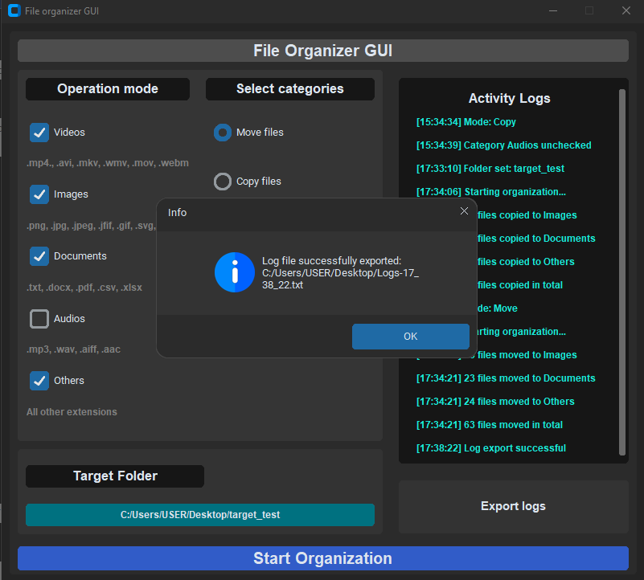

# File Organizer GUI

A desktop application built with Python and CustomTkinter that organizes files in a selected folder by category.

The application allows the user to choose which categories should be organized, select move or copy mode, view activity logs in the interface, and export logs to a `.txt` file.

## Features

- Select a target folder through the GUI
- Organize files into categories:
  - Images
  - Documents
  - Audios
  - Videos
  - Others
- Choose between **move** mode and **copy** mode
- Prevent file name conflicts automatically
- Show activity logs in the interface
- Export logs to a text file
- Validate missing folder or category selection

## Supported categories

- **Images:** `.png`, `.jpg`, `.jpeg`, `.jfif`, `.gif`, `.svg`, `.webp`
- **Documents:** `.txt`, `.docx`, `.pdf`, `.csv`, `.xlsx`
- **Audios:** `.mp3`, `.wav`, `.aiff`, `.aac`
- **Videos:** `.mp4`, `.avi`, `.mkv`, `.wmv`, `.mov`, `.webm`
- **Others:** any extension not included in the categories above

## Technologies used

- Python
- CustomTkinter
- CTkMessagebox
- pathlib

## How to run

1. Clone this repository
2. Open the project folder
3. Create a virtual environment:

```bash
py -m venv .venv
```

4. Activate the virtual environment:

```bash
.venv\Scripts\activate
```

5. Install the dependencies:

```bash
py -m pip install customtkinter CTkMessagebox
```

6. Run the application:

```bash
py main.py
```

## Project structure

- `gui.py` - graphical interface and user interaction
- `organizer.py` - file organization logic and log export functionality

## Screenshots

### Main interface


### Export success

